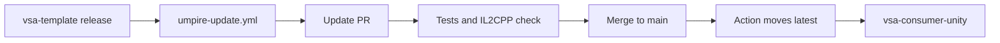

# vsa-unity

This repository is the Unity project of the UPM package `com.vsa.core`: the Umpire framework (VSA pack) for Unity 6000.6.
The package is embedded in `Packages/com.vsa.core/`. The project runs the Unity tests of the package and an IL2CPP player check of a sample module.

## Install the package

Add the git URL to `Packages/manifest.json`. The tag `latest` is the last commit of `main`.

```json
"com.vsa.core": "https://github.com/MgCohen/vsa-unity.git?path=/Packages/com.vsa.core#latest"
```

Unity writes the commit hash of the package to `packages-lock.json`. To get the last commit, click **Update** in the Package Manager, or delete the `com.vsa.core` entry of `packages-lock.json`.

For offline or patched use, copy `Packages/com.vsa.core/` into the `Packages/` folder of the consumer project. The package documentation is in [`Packages/com.vsa.core/README.md`](Packages/com.vsa.core/README.md).

## Repository layout

| Path | Contains |
|---|---|
| `Packages/com.vsa.core/` | The package: runtime, editor scripts, tests |
| `Assets/Sample/` | A small module in one asmdef |
| `Assets/SampleApp/` | `SampleShell`, `SampleHost` and the `Check` view of the IL2CPP check |
| `Assets/VContainerSample/` | A VContainer scene that uses the two directions of `Umpire.Unity.VContainer` |
| `Assets/Editor/Il2cppCheck.cs` | Builds the IL2CPP player of the check |
| `update-umpire.ps1` | Copies the Umpire DLLs and analyzers of a template release into the package |
| `.github/workflows/umpire-update.yml` | Opens the update PR for each new template release |

## Commands

| Command | Does |
|---|---|
| `./update-umpire.ps1 [-Version <version>]` | Copies the DLLs of a template release to the package (default: the newest release) |
| `./run-tests.ps1` | Runs the EditMode and PlayMode tests |
| `./il2cpp-check.ps1` | Builds and runs the IL2CPP player |

`update-umpire.ps1` downloads `umpire-<version>.zip` from the vsa-template release. It needs no token and no .NET SDK. It checks the SHA-256 value of each file in `manifest.json`.

## Release


```mermaid
flowchart LR
    T[vsa-template release] --> W[umpire-update.yml]
    W --> P[Update PR]
    P --> C[Tests and IL2CPP check]
    C --> M[Merge to main]
    M --> L[Action moves latest]
    L --> U[vsa-consumer-unity]
```

1. The workflow `umpire-update.yml` runs each day. For a new template release, it runs `update-umpire.ps1` and opens a PR. To start it now, use "Run workflow" on the Actions page.
2. Check out the PR branch. Run `./run-tests.ps1` and `./il2cpp-check.ps1`.
3. Merge the PR to `main`.

The workflow `.github/workflows/latest-tag.yml` moves the tag `latest` to each commit of `main`. No other step adds a tag.

## The IL2CPP check

`il2cpp-check.ps1` builds a Windows IL2CPP player with managed stripping Minimal, and runs it. The player starts the app through `SampleShell` (a `Shell<Vsa<SampleHost>>`) and writes `CHECK` lines to its log.

| Line | Shows |
|---|---|
| `shell`, `presenter-dispatch` | `SampleShell` owns the app, and `UnityHost` adds the dispatch |
| `modules`, `typeArguments` | `SampleHost` gives the one-asmdef module |
| `request`, `presenter-event` | A request from a thread pool thread; the event runs on the main thread |
| `struct-argument` | Handlers closed over struct type arguments |
| `stopped` | The quit destroys the shell, and `OnStop` runs |

The check runs on a dev machine only. It needs the Windows IL2CPP module of Unity 6000.6.6f1.

## Open questions

- Stable versions: `latest` has no pinned versions and no test gate. When do consumers need version tags?
- Unity CI: a Unity license in GitHub Actions needs a license secret.
